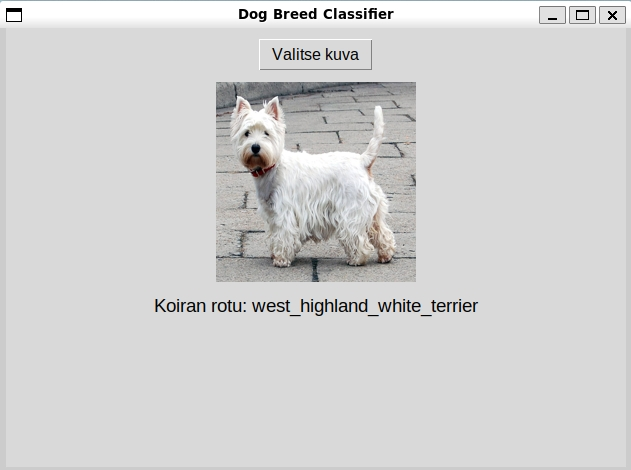

# 🐶 Dog Breed Classifier

Tämä projekti tunnistaa koirarodut kuvista käyttäen **TensorFlow-mallia**. Käyttöliittymä (Tkinter) mahdollistaa kuvien valinnan ja rodun ennustamisen. Mukana on myös koulutusskripti uusien mallien luomiseen. Repository ei sisällä valmista mallia, mutta voin tarpeen tullen jakaa koulutetun mallin.

## 📌 Datasetti
Tässä projektissa käytetään Kaggle-datasettiä:  
**[Dog Breed Identification](https://www.kaggle.com/competitions/dog-breed-identification/overview)**  

Datasetti sisältää yli **20 000 kuvaa** eri koiraroduista, ja niitä käytetään mallin kouluttamiseen.

---

## 📜 Projektin sisältö
- `train_model.py` – **Koulutusskripti**, joka kouluttaa uuden mallin ja tallentaa sen.
- `dog_classifier_gui.py` – **Tkinter-pohjainen käyttöliittymä**, jossa voi valita kuvan ja saada ennustetun koirarodun.
- `requirements.txt` – Lista vaadituista Python-kirjastoista.

---

## 🚀 Asennusohjeet

### 1️⃣ Kloonaa repository
```bash
git clone https://github.com/JesseSipari/dog-breed-classifier.git
cd dog-breed-classifier
```

### 2️⃣ Luo Python-virtuaaliympäristö ja asenna riippuvuudet
```bash
python -m venv env
source env/bin/activate  # Windowsissa: env\Scripts\activate
pip install -r requirements.txt
```

### 3️⃣ Lataa Kaggle-datasetti
Lataa datasetti Kaggle-sivustolta: **[(https://www.kaggle.com/competitions/dog-breed-identification/)](https://www.kaggle.com/competitions/dog-breed-identification/overview)**
Sijoita ladatut tiedostot seuraavasti:

```bash

dog-breed-classifier/
│── train/           # Sisältää opetusdatan kuvat
│── test/            # Sisältää testidatan kuvat
│── labels.csv       # Sisältää koulutuskuvien koirarodut
│── train_model.py
│── dog_classifier_gui.py
│── requirements.txt
│── ...
```
### 4️⃣ Kouluta malli
```bash
python train_model.py
```

### 5️⃣ Käynnistä käyttöliittymä (GUI)
```bash
python dog_classifier_gui.py
```

### Huomioitavaa
train_model.py tallentaa koulutetun mallin tiedostoksi (dog_breed_inception.keras), mutta se ei ole GitHub-repossa (.gitignore estää sen tallentamisen).
Jos käytät GPU:ta, varmista, että CUDA ja cuDNN on asennettu oikein TensorFlow:n GPU-kiihdytystä varten.

##### ✅ Nykyiset ominaisuudet:

- Koirarodun tunnistus TensorFlow-mallilla
- Yksinkertainen Tkinter-käyttöliittymä, jossa voi ladata kuvan ja nähdä ennustetun rodun
- Koulutusskripti mallien luomiseen

#### 🔜 Tulevat päivitykset:

- Mahdollisuus valita käytettävä malli GUI:ssa
- Uuden datan lisääminen opetus- ja testidataan GUI:n kautta.
- Mahdollisuus lisätä koirarotuja
- Tarkempi koulutusprosessin visualisointi

